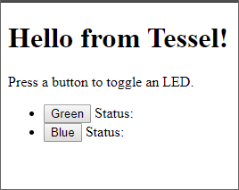
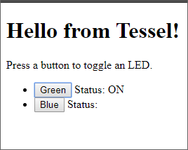

# tessel-http-led

* [Overview](#overview)
    * [History](#history)
        * [Modifications](#modifications)
* [Requirements](#requirements)
* [Use](#use)
* [Toolbox](#toolbox)
    * [Tessel Environment Versions](#tessel-environment-versions)
    * [Tools](#tools)
        * [File Editing](#file-editing)
        * [Image Editing](#image-editing)
        * [Version Control](#version-control)
        * [Testing](#testing)

# Overview

The files contained in this repository are intended to be ran on a **Tessel 2**. Their purpose is to demonstrate an HTTP server and API. A browser is used to view an HTML file which contains buttons that will cause the green or blue LEDs to toggle their state.

## History

This project code is modified from the *some* of the same files found at - 

<https://github.com/HipsterBrown/tessel-router.git>

### Modifications

* **`index.js`** - 
    * Added ability to use POST rather than GET to toggle the LEDs.
    * Added _toggleLED() to toggle the LED for POST requests.
    * Kept the ability to use GET (*for demonstration*) to toggle the LEDs.
    * Renamed some function arguments: `request` to `req` and `response` to `res`.
    * Removed the arg `url` from showIndex(), it was unused.
    * Added calls to console.log() to output additional run-time info.
    * Added comments.
    * Removed the unused `req` arg in the following -
        * `showFavicon(req, res)` to `showFavicon(res)`
        * `showIndex(req, res)` to `showIndex(res)`
        * `toggleLED(url, req, res)` to `toggleLED(url, res)`

* **`index.html`** - 
    * In `toggleLED()` changed method to POST from GET.
    * Removed the call to req.send(null), it was causing DOM errors. (*might not be required for POST*)

# Requirements

You will require the following - 

* A PC/Mac with NodeJS installed.
* A **Tessel 2** configured and working with Tessel example code(*i.e. "Blinky"*).
* Your favorite code editor.
* Somewhere comfortable to sit & work.

# Use

All the necessary files are within this repo. You should copy them into a convenient folder and then open a command line in that folder.

Next you will need the IP address of your Tessel board. This will give you that information -

`t2 wifi`

You should see something like this - 

```
INFO Looking for your Tessel...
INFO Connected to Tessel-02A30CB079FF.
INFO Connected to "YOUR_SSID"
INFO IP Address: 192.168.0.26
INFO Signal Strength: (70/70)
INFO Bitrate: 54mbps
```

Copy the **IP address**, you'll need it for the browser.

Now you can run this command and start the application - 

`t2 run index.js`

You should see output similar to the following - 

```
INFO Looking for your Tessel...
INFO Connected to Tessel-02A30CB079FF.
INFO Building project.
INFO Writing project to RAM on Tessel-02A30CB079FF (9.216 kB)...
INFO Deployed.
INFO Running index.js...
```

Next open a browser and point it at `http://`**`<your-tessel-ip-address>`**`:8080`.



And at the same time you should see similar output from the Tessel - 

```
method = GET
path = /
method = GET
path = /favicon.ico
```

Now click one of the buttons and the corresponding LED will turn on(*or off*) and its status change will be displayed in the browser.



And at the same time you should see similar output from the Tessel -

```
method = POST
Partial body: {"ledidx":"2"}
Body: {"ledidx":"2"}
ledidx = 2
```

# Toolbox

I'm running Windows 10 64bit with NodeJS 6.10.2.

## Tessel Environment Versions

* t2-cli: 0.1.8
* t2-firmware: 0.1.0
* Node.js: 6.10.3

## Tools

My favorite development tools are - 

### File Editing

* **Notepad++** : <https://notepad-plus-plus.org/> General editing.
* **Markdown Edit** : <http://markdownedit.com/> Used for editing this README file.
* **Winmerge** : <http://winmerge.org/> File differences.

### Image Editing

* **PaintDOTNet** - <https://www.getpaint.net/> Used in creating the images for this document.

### Version Control

* **Gitkraken** : <https://www.gitkraken.com/>

### Testing

* **Postman** : <https://www.getpostman.com/> An excellent tool for testing servers and APIs. Included in this repo are two files containing exports of collections used in testing - 

* `Tessel.postman_collection-v1.json` - A version 1 Postman collection
* `Tessel.postman_collection-v2.json` - A version 2 Postman collection

Both contain the following - 

**Tessel - HTTP GET** - Requests `/` and gets `index.html` in the response.

**Tessel - HTTP GET favicon** - Requests `/favicon.ico`.

**Tessel - HTTP GET leds** - Requests `/leds/2` and toggles the green LED.

**Tessel - HTTP POST LEDS** - Posts `{"ledidx":2}` to toggle the green LED.

The server will respond with `{"on":false}` or `{"on":true}` depending on the state of the LED after it was toggled.

